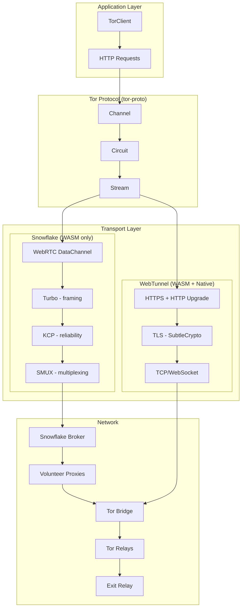

# webtor-rs

A Rust Tor client for WebAssembly. Provides anonymous HTTP/HTTPS through Tor using Snowflake (WebRTC) and WebTunnel bridges.

```
                             ░██           ░██                        
                             ░██           ░██                        
░██    ░██    ░██  ░███████  ░████████  ░████████  ░███████  ░██░████ 
░██    ░██    ░██ ░██    ░██ ░██    ░██    ░██    ░██    ░██ ░███     
 ░██  ░████  ░██  ░█████████ ░██    ░██    ░██    ░██    ░██ ░██      
  ░██░██ ░██░██   ░██        ░███   ░██    ░██    ░██    ░██ ░██      
   ░███   ░███     ░███████  ░██░█████      ░████  ░███████  ░██      
```

## Features

- **Arti-based** - Uses official Tor Project crates with full TLS validation
- **Two Transports** - Snowflake (WebRTC) and WebTunnel (HTTPS)
- **Full Tor Protocol** - 3-hop circuits with ntor-v3 handshakes
- **TLS 1.3 Support** - Pure-Rust TLS via SubtleCrypto (WASM)
- **Circuit Reuse** - Persistent circuits for performance
- **Consensus Fetching** - Automatic relay discovery with caching

## Quick Start

```bash
./build.sh
cd webtor-demo/static && python3 -m http.server 8000
# Open http://localhost:8000
```

## Usage

```rust
use webtor::{TorClient, TorClientOptions};

// Snowflake (WASM only - uses WebRTC)
let client = TorClient::new(TorClientOptions::snowflake()).await?;

// WebTunnel (WASM + Native)  
let client = TorClient::new(
    TorClientOptions::webtunnel(url, fingerprint)
).await?;

// Bootstrap and make requests
client.bootstrap().await?;
let response = client.get("https://example.com/").await?;
println!("{}", response.text()?);

client.close().await;
```

## Architecture



## Transports

| Transport | WASM | Native | Notes |
|-----------|------|--------|-------|
| Snowflake | Yes | No | WebRTC via volunteer proxies (correct architecture) |
| WebTunnel | Yes | Yes | HTTPS, works through corporate proxies |

## Status

| Component | Status | Notes |
|-----------|--------|-------|
| Tor Protocol | Complete | ntor-v3, CREATE2, 3-hop circuits |
| Snowflake | Complete | WebRTC + Broker API + Turbo/KCP/SMUX |
| WebTunnel | Complete | HTTPS Upgrade with TLS validation |
| Consensus | Complete | Fetching + parsing + 1hr caching |
| HTTP Client | Complete | GET/POST through exit relays |
| TLS (WASM) | Complete | TLS 1.3 via SubtleCrypto |
| Demo App | Working | Interactive browser UI |

## Limitations

- **TLS 1.3 Only** - Sites requiring TLS 1.2 (like httpbin.org) won't work
- **Onion Services** - `.onion` addresses not yet implemented  
- **Stream Isolation** - All requests share one circuit
- **Mobile** - Not optimized for mobile browsers

## Roadmap

- [x] Tor protocol (Arti integration)
- [x] HTTP/HTTPS through Tor
- [x] Snowflake (WebRTC + Broker API)
- [x] WebTunnel (HTTPS Upgrade)
- [x] TLS 1.3 support (SubtleCrypto)
- [x] Consensus fetching and caching
- [ ] TLS 1.2 support
- [ ] Onion service support
- [ ] Performance optimizations
- [ ] Security audit

## Documentation

- [PROJECT_SUMMARY.md](PROJECT_SUMMARY.md) - Detailed roadmap and architecture
- [COMPARISON.md](COMPARISON.md) - Comparison with echalote

## Testing

```bash
# Unit tests
cargo test -p webtor

# E2E tests (requires network)
cargo test -p webtor --test e2e -- --ignored --nocapture
```

## License

MIT
