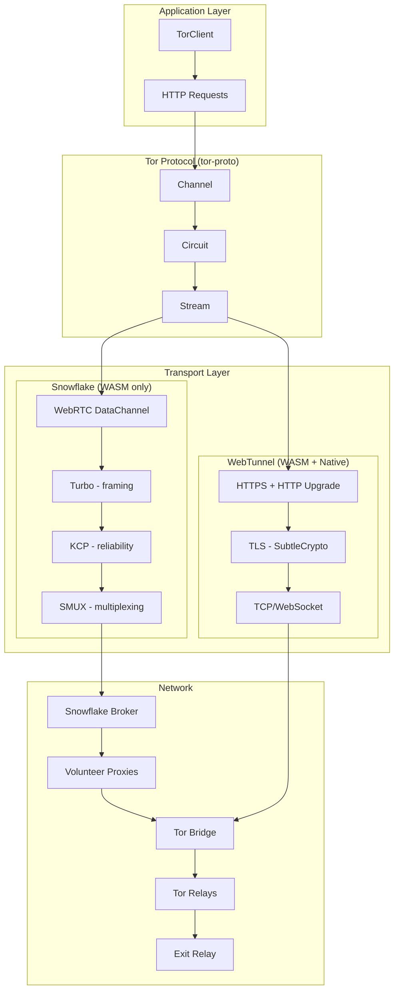

# webtor-rs

[](https://github.com/igor53627/webtor-rs/actions/workflows/test.yml)
[](https://deepwiki.com/igor53627/webtor-rs)

A browser-focused Tor client written in Rust and compiled to WebAssembly (WASM), with optional native support. It enables anonymous HTTP/HTTPS connections through the Tor network directly from web browsers, without requiring plugins, extensions, or native applications.

**[Live Demo](https://igor53627.github.io/webtor-rs/)**

## Key Capabilities

| Capability | Implementation | Status |
|------------|----------------|--------|
| Tor Protocol | `tor-proto` crate (official Arti) | Full support for v3-v5 |
| Circuit Creation | CREATE2 with ntor-v3 handshake | Modern, secure |
| TLS Security | TLS 1.3 (preferred) with TLS 1.2 fallback and certificate validation | Hardened, actively tested |
| Snowflake Bridge | WebSocket + WebRTC transports | WASM-compatible |
| WebTunnel Bridge | HTTPS with RFC 9298 upgrade | Native + WASM |
| Consensus | Embedded snapshot + online fetch | Daily auto-updates, 1h cache |
| Cryptography | SubtleCrypto (browser) + Dalek crates | Audited libraries |

## Features

- **Arti-based** - Uses official Tor Project crates with full TLS validation
- **Two Transports** - Snowflake (WebRTC) and WebTunnel (HTTPS)
- **Full Tor Protocol** - 3-hop circuits with ntor-v3 handshakes
- **TLS 1.3 + 1.2 Support** - Pure-Rust TLS via SubtleCrypto (WASM) with automatic TLS 1.2 fallback
- **Stream Isolation** - Separate circuits per domain using Mozilla's Public Suffix List (Tor Browser-style)
- **Circuit Reuse** - Persistent circuits for performance
- **Consensus Handling** - Embedded snapshot + online fetching with 1-hour caching (no CORS issues)

## Quick Start

```bash
./build.sh
cd webtor-demo/static && python3 -m http.server 8000
# Open http://localhost:8000
```

## Usage

```rust
use webtor::{TorClient, TorClientOptions};

// Snowflake (WASM only - uses WebRTC)
let client = TorClient::new(TorClientOptions::snowflake()).await?;

// WebTunnel (WASM + Native)  
let client = TorClient::new(
    TorClientOptions::webtunnel(url, fingerprint)
).await?;

// Configure stream isolation (default: PerDomain)
let client = TorClient::new(
    TorClientOptions::snowflake()
        .with_stream_isolation(StreamIsolationPolicy::PerDomain)
).await?;

// Bootstrap and make requests
client.bootstrap().await?;
let response = client.get("https://example.com/").await?;
println!("{}", response.text()?);

// POST request
let body = b"key=value".to_vec();
let response = client.post("https://httpbin.org/post", body).await?;

client.close().await;
```

### WASM / JavaScript API

```typescript
import init, { TorClient, TorClientOptions } from 'webtor-wasm';

await init();
const options = TorClientOptions.snowflakeWebRtc();
const client = await new TorClient(options);

// GET request
const response = await client.fetch('https://example.com/');
console.log(await response.text());

// POST request (raw body)
const body = new TextEncoder().encode('key=value');
const response = await client.post('https://httpbin.org/post', body);

// POST JSON (convenience for JSON-RPC, auto-sets Content-Type)
const response = await client.postJson('https://rpc.example.com', JSON.stringify({
  jsonrpc: '2.0',
  method: 'eth_blockNumber',
  params: [],
  id: 1
}));
const data = await response.json();

// Full control: custom method, headers, body, timeout
const response = await client.request(
  'POST',
  'https://api.example.com',
  { 'Content-Type': 'application/json', 'Authorization': 'Bearer token' },
  body,
  30000  // timeout in ms
);

await client.close();
```

## Architecture



## Core Components

| Crate | Description |
|-------|-------------|
| `webtor` | Core Tor client library with TorClient, circuit management, relay selection |
| `webtor-wasm` | WASM bindings using wasm-bindgen for JavaScript interop |
| `webtor-demo` | Demo application with embedded consensus |
| `subtle-tls` | TLS 1.2/1.3 implementation using browser SubtleCrypto APIs |

## Transports

| Transport | WASM | Native | Notes |
|-----------|------|--------|-------|
| Snowflake (WebSocket) | Yes | No | Direct connection to bridge (simpler) |
| Snowflake (WebRTC) | Yes | No | Via volunteer proxies (more censorship resistant) |
| WebTunnel | Yes | Yes | HTTPS, works through corporate proxies |

## Comparison with echalote

| Feature | webtor-rs | echalote |
|---------|-----------|----------|
| Protocol | Official `tor-proto` crate | Custom TypeScript |
| TLS Validation | Yes (SubtleCrypto) | No (vulnerable to MITM) |
| Handshake | ntor-v3 (modern) | ntor (legacy) |
| Circuit Creation | CREATE2 | CREATE_FAST |
| Language | Rust (memory-safe) | TypeScript |
| Maturity | Actively developed | Experimental |

## Use Cases

- **Censorship Circumvention** - Access blocked websites through Tor bridges in restrictive networks
- **Anonymous Browsing** - Make HTTP requests without revealing IP address or location
- **Privacy-Preserving Applications** - Build web apps that protect user anonymity by default
- **Educational Tools** - Demonstrate Tor protocol and cryptography in browser environment

## Status

| Component | Status | Notes |
|-----------|--------|-------|
| Tor Protocol | Complete | ntor-v3, CREATE2, 3-hop circuits |
| Snowflake (WS) | Complete | Direct WebSocket + Turbo/KCP/SMUX |
| Snowflake (WebRTC) | Complete | Broker API + volunteer proxies |
| WebTunnel | Complete | HTTPS Upgrade with TLS validation |
| Consensus | Complete | Embedded snapshot + fetching, 1h caching |
| HTTP Client | Complete | GET/POST through exit relays |
| TLS (WASM) | Complete | TLS 1.3 via SubtleCrypto with automatic TLS 1.2 fallback |
| Demo App | Working | Interactive browser UI |

## Security

- This project is **not** a full replacement for Tor Browser. It does not protect against browser fingerprinting or application-layer leaks.
- TLS certificate validation is enforced, but the implementation has **not yet undergone a formal third-party security audit**.
- For a hardened, end-user-oriented browser experience, use [Tor Browser](https://www.torproject.org/) instead.

## Limitations

- **TLS 1.2 Maturity** - TLS 1.2 fallback is newer and less battle-tested than TLS 1.3
- **Onion Services** - `.onion` addresses not yet implemented  
- **Mobile** - Not optimized for mobile browsers

## Roadmap

- [x] Tor protocol (Arti integration)
- [x] HTTP/HTTPS through Tor
- [x] Snowflake WebSocket (direct bridge connection)
- [x] Snowflake WebRTC (volunteer proxies via broker)
- [x] WebTunnel (HTTPS Upgrade)
- [x] TLS 1.3 support (SubtleCrypto)
- [x] Consensus fetching and caching
- [x] TLS 1.2 support (automatic fallback)
- [x] Stream isolation per domain
- [ ] Onion service support
- [ ] Performance optimizations
- [ ] Security audit

## Documentation

- [PROJECT_SUMMARY.md](PROJECT_SUMMARY.md) - Detailed roadmap and architecture
- [COMPARISON.md](COMPARISON.md) - Comparison with echalote
- [DeepWiki Documentation](https://deepwiki.com/igor53627/webtor-rs) - AI-generated documentation

## Testing

```bash
# Unit tests
cargo test -p webtor

# Property-based tests (proptest)
cargo test -p webtor proptest

# E2E tests (requires network)
npm run test:tls

# Benchmarks (requires network)
cargo bench -p webtor --bench tor_benchmark

# Criterion microbenchmarks (deterministic)
cargo bench -p webtor --bench circuit_params

# Fuzz tests (manual trigger via GitHub Actions)
cd subtle-tls/fuzz && cargo +nightly fuzz run fuzz_server_hello
```

## CI/CD

| Workflow | Trigger | Purpose |
|----------|---------|---------|
| Tests | Push/PR | Unit tests, E2E, WASM build, Clippy, Rustfmt |
| Property Tests | Push/PR | Proptest for turbo, smux, relay modules |
| Fuzz Testing | Manual | Fuzz testing for TLS parsing |
| WASM Build | Push/PR | Build and size check |
| Daily Consensus | Scheduled | Update cached consensus data |
| Deploy Example | Push to main | Deploy demo to GitHub Pages |

## License

MIT
